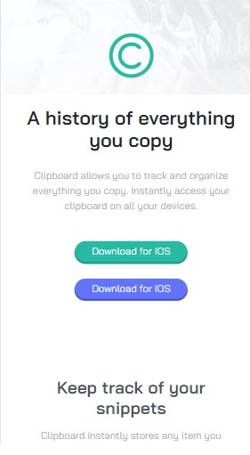
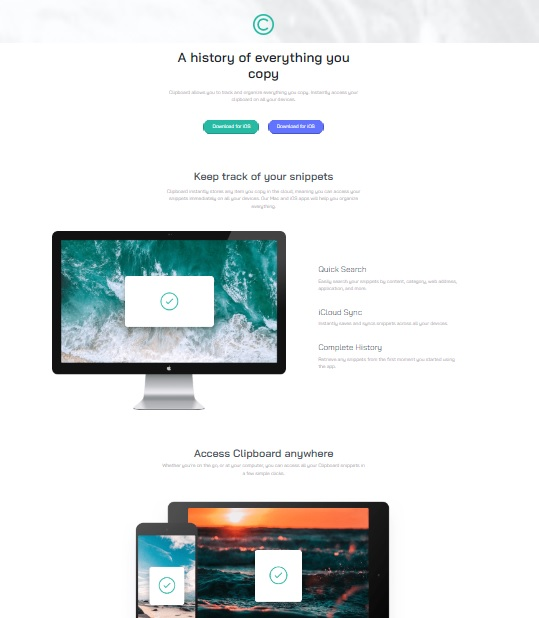

# Landing page 
## Clipboard Master

### Proyect
Landing page Clipboard Master is a challenging project in which the interface was delivered graphically and had to be solved using _html_ and _css_ code.
The same was used the concept of web design _Mobile first_ that in addition to giving a better web positioning, gives a great visibility on any device.

### Technologies used

In addition to the already mentioned _html_ and _css_ markup and styling languages respectively, in this project we also used a library for the _ScrollReveal_ effects called _ScrollReveal_.
And last but not least, we used for the layout of this project, one of the most known framework in the Front-end world _Bootstrap_.

### Url Web Site

https://zalliopablo.github.io/landigpage_clipboardmaster/

### Images

#### DESIGN MOBILE

#### DESIGN DESKTOP

# landingpage_clipboardmaster
